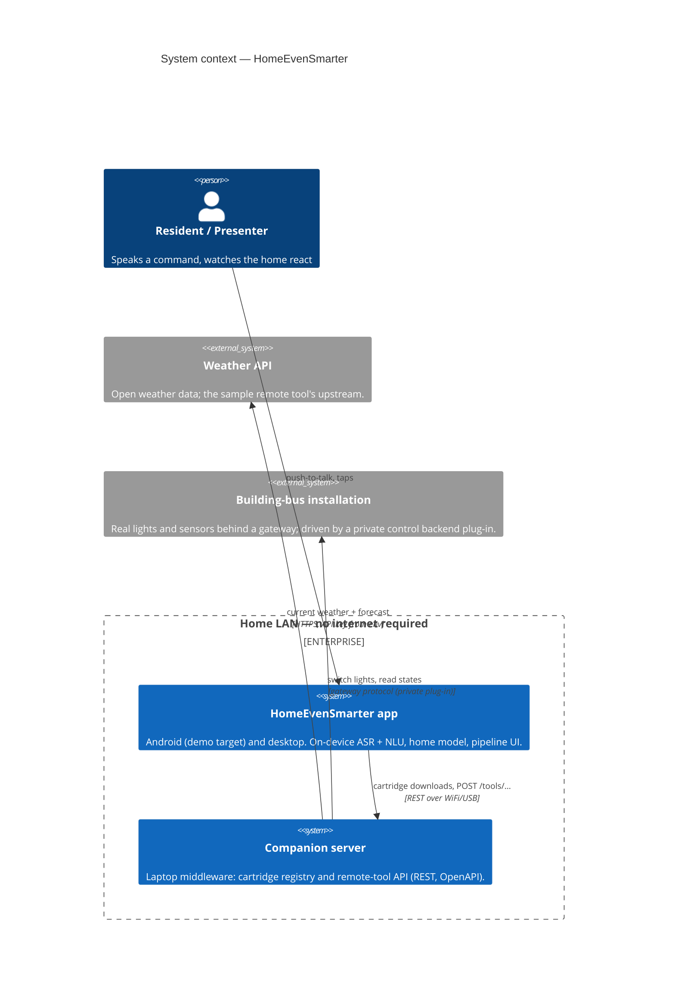

# Level 1 — System context

The resident speaks to the app; everything that must work lives on the device. The companion is an
optional laptop on the same network: it distributes model cartridges and executes the few tools
that genuinely need the outside world.

- The **app never knows** what sits behind the companion: weather, a building bus, or nothing.
- Without a companion the app still listens, understands and controls its home model; remote tools
  fail softly and land on the escalation seam.
