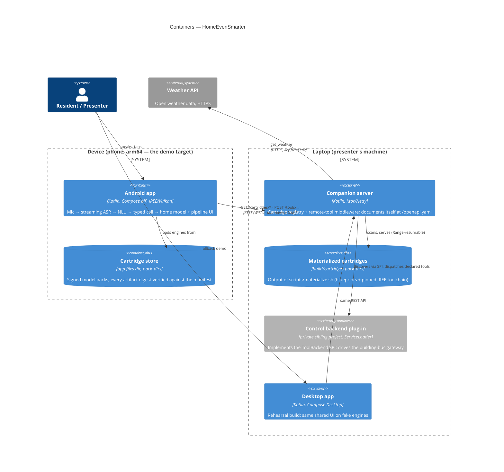

# Level 2 — Containers

What actually runs, and what travels between the pieces. The Gradle modules `:core`, `:cartridges`,
`:app:shared` and `:app:design` are libraries compiled *into* the apps, so they appear at level 3,
not here.

- The cartridge store's on-disk layout **is** the pack_dir layout, so the same packs arrive over
  REST (resumable, digest-checked) or over USB (`scripts/sideload-cartridges.sh`).
- The control backend is `runtimeOnly` and discovered at startup — absent, the server answers
  control tools with a soft `"no control backend"`.
