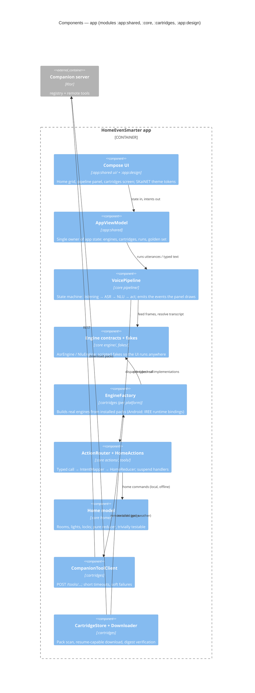

# Level 3 — Components: the app

One utterance, module by module. Everything below is shared Kotlin Multiplatform code; the Android
and desktop apps only inject platform pieces (engine factory, microphone, settings) through
`AppEnvironment`.

- The **escalation seam** (`:core hybrid/`) hangs off the pipeline: a failed or unanswerable call
  lands there instead of crashing; today's remote tools make the first rung real.
- Swapping fakes for real engines changes **no line** of UI or pipeline code — only what
  `EngineFactory` returns.
