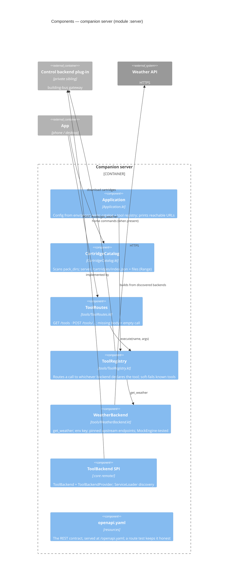

# Level 3 — Components: the companion

A deliberately small Ktor application: parameters in, testable pieces, no DI framework.

- The wire types and the `ToolBackend` SPI live in `:core`, so a backend depends on tiny pure
  Kotlin — never on Ktor or the server.
- Everything is exercised by `testApplication` tests: no-backend soft failures, 404 for unknown
  tools, backend pass-through, and the self-served OpenAPI document.
